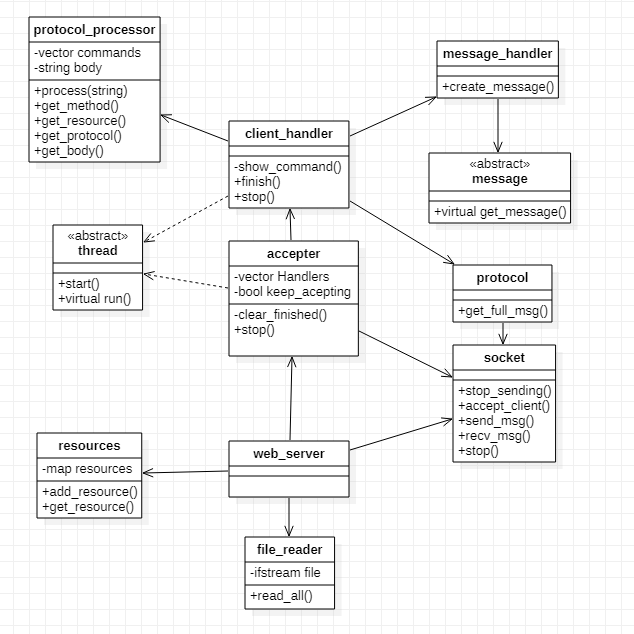

# Taller pages - Ejercicio N° 3

- **Francisco Bertolotto - 102671**
- **https://github.com/fbertolotto/7542-TP3**
- **2do Cuatri - 2020**

---

## Enunciado
Se desarrollará una aplicación servidor que atenderá petitorios HTTP, mediante los cuales podrá acceder y dar alta a recursos del mismo.
Para ello manejaremos dos petitorios, GET y POST. Siguiendo las siguientes reglas:

> GET /
- La respuesta será “HTTP/1.1 200 OK\nContent-Type: text/html\n\n” seguido del contenido del < root_content >.
> GET /RECURSO
- Si el recurso existe, la respuesta será “HTTP/1.1 200 OK\n\n” seguido del contenido del recurso.
- Si el recurso no existe, la respuesta será “HTTP/1.1 404 NOT FOUND\n\n”

> POST /
- La respuesta será “HTTP/1.1 403 FORBIDDEN\n\n”

> POST /RECURSO
- Se creará el recurso correspondiente a la ruta, y su contenido será el Body del mensaje. La respuesta será “HTTP/1.1 200 OK\n\n” + el body recibido.

> Otro "metodo"
- La respuesta sera “HTTP/1.1 405 METHOD NOT ALLOWED\n\n "metodo" es un comando desconocido”.

## Diseño General

La estructura general del programa se divide en varios módulos.

## Resumen

El programa principal creara un hilo aceptador (`accepter`) y se quedara esperando por una "q" para ser finalizado.
El aceptador se encargara de aceptar a los clientes, crear un hilo procesador(`client_handler`) y enviarle los recursos necesarios para que pueda procesar.
El hilo procesador (`client_handler`), se comunicara con el cliente a través del `socket` obtenido por el `aceptador`, recibirá el mensaje a procesar a través del `protocolo`, lo parseara, obtendrá los valores necesarios y en base a eso generara la instrucción. Una vez obtenida se analizara si es un POST /RECURSO; en caso positivo se procederá a guardar en los recursos del servidor, el cuerpo del mensaje. Si es negativo, se omitirá este paso y se procederá al siguiente, generar la respuesta.
Para generar la respuesta el procesador delegara la responsabilidad al `message_handler`. Se le enviara el método, el recurso solicitado y los recursos disponibles, así el `message_handler` generara el mensaje especifico para la situación.
Una vez generado, el mensaje se enviara a través del socket hacia el cliente, para que este pueda imprimirlo por salida estándar.

Si en cualquier momento se recibe una "q" mediante entrada estándar; el servidor indicara al aceptador que deje de trabajar y finalizaran todos los hilos que se encuentren en ejecución en ese momento (se garantizara que finalizaran la comunicación antes de cerrarse).

## Polimorfismo en respuestas del servidor

Para garantizar el polimorfismo en las respuestas, se utilizo la clase abstracta mensaje.
Como se menciono previamente, el `message_handler` devuelve la respuesta que enviaremos al cliente, sin embargo, el `client_handler` desconoce que tipo de respuesta es, solo sabe que es de tipo `"Message"`, aquí es donde se aplica el polimorfismo, ya que todas las clases que heredan de `"Message"` responden diferente al `"get_message()"` algunas simplemente devuelven un string predefinido mientras que otras necesitan agregarle mas información (la cual le fue suministrada durante la creación dentro del `message_handler`); de esta forma es muy sencillo generar nuevos tipos de mensaje, simplemente se debe agrega la clase para el caso, especificar que devuelve y agregar su condición en el `message_handler`, (evitando así modificar el `client_handler`.)

## Detalles de implementación

### Pasaje del socket del aceptador al client_handler

Para evitar problemas relacionados con los file descriptor, el pasaje es a través de move semantincs. De esta forma evitamos hacer un doble close/shutdown.

### Recursos accedidos por varios hilos

Para protegerlo de cualquier race condition, los recursos están protegidos por un mutex; de esta forma se evita que dos hilos intenten acceder o guardar al mismo recurso al mismo tiempo. 

### Manejo de errores

Se implementaron dos tipos de errores, los errores relacionados con el manejo archivo y los errores de socket (connection error); esto nos permite un mayor control del flujo del programa durante alguna excepción.
El ejemplo mas claro se da que al cerrar el servidor, se enviá un close al socket principal haciendo que el hilo aceptador obtenga un error en la parte donde acepta cliente (puesto que se cerro el socket); este error es atrapado y si ademas se le indico que dejara de aceptar terminara ordenadamente la ejecución.
También existe el caso end onde pueda fallara el accept por otra razón (al cliente se le corto el internet en el medio de intercambio); en este caso el error también sera atrapado y como el aceptador aun posee la orden de seguir aceptando intentara con el próximo.
ASi obtenemos un servidor robusto a los problemas de conexión, haciendo difícil que un cliente pueda apagar el servidor remotamente.
